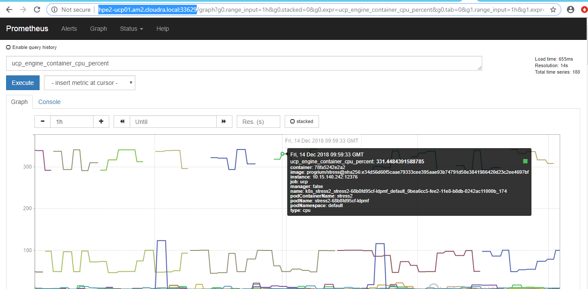
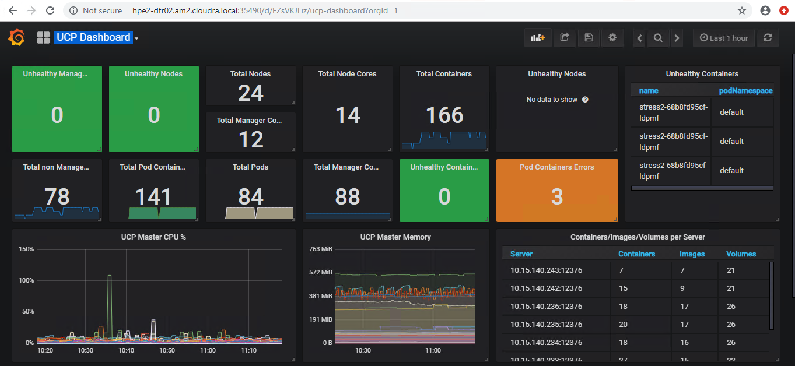

# ucp-prom-graf-k8s

See https://docs.docker.com/ee/ucp/admin/configure/collect-cluster-metrics/#configure-external-prometheus-to-scrape-metrics-from-ucp

## Deploy Prometheus
kubectl apply -f prom_configmap.yml

kubectl apply -f prom_deployment.yml

kubectl apply -f prom_service.yml

kubectl get services

NAME|                TYPE|        CLUSTER-IP|      EXTERNAL-IP|   PORT(S)       |          AGE|
| ------------- |:-------------|:----------------|:------------|:--------------|:-------------|
prometheus|   NodePort|    10.96.150.101|   <none>|        9090:33629/TCP|   16h|

http://hpe2-ucp01.am2.cloudra.local:33629

## Deploy Grafana
 
kubectl apply -f graf_deployment.yml

kubectl apply -f graf_service.yml

kubectl get services

NAME|         TYPE|        CLUSTER-IP|      EXTERNAL-IP|   PORT(S)|          AGE|
| ------------- |:-------------|:----------------|:------------|:--------------|:-------------|
grafana|      NodePort|    10.96.227.55|    <none>|        3000:35490/TCP|   1h|

http://hpe2-ucp01.am2.cloudra.local:35490

## Configure Grafana

Create prometheus datasource
http://prometheus:9090 

Import UCP dashboard
https://grafana.com/dashboards/9309

